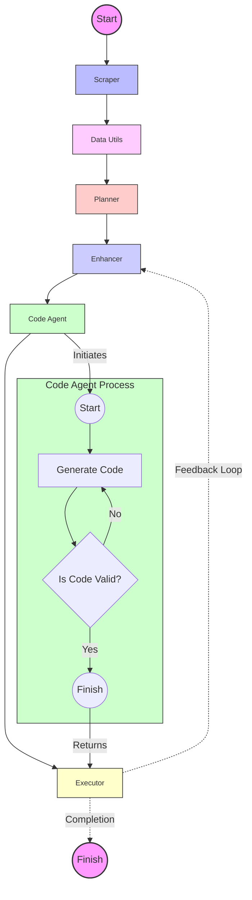

# 🚀 Kaggle Problem Solver: Your AI-Powered ML Sidekick

> Note that because of nature of project it could be very dependant to iterarions and no plan is strait forward for this type of projects.

---

**Future Plans:**

- [ ] add visual management system 📊
- [ ] back to the future ⏰⬅️🚗 <small>add time travel to memory system and agent</small>
- [ ] **nerds with needles 🤓💉** <small>knowledge injection</small>
- [ ] <b>Assembly of philosophers and a chalice(🤔)\*🥛 </b> <small>agent orchestration</small>

## 🌟 Overview

Welcome to the Kaggle Problem Solver, the Swiss Army knife of machine learning challenges! This isn't just any old problem solver – it's your AI-powered companion in the wild world of Kaggle competitions. Using a "plan and execute" strategy that would make any project manager jealous, our system tackles ML problems with the finesse of a seasoned data scientist and the tireless energy of a thousand interns. **code generation agent is inspired from langgraph agent [<u>link</u>](https://blog.langchain.dev/code-execution-with-langgraph/)**

## 🧠 Key Components

1. **The Mastermind (KaggleProblemPlanner)**: Plans your path to Kaggle glory!
2. **The Perfectionist (KaggleTaskEnhancer)**: Turns good tasks into great ones!
3. **The Code Wizard (CodeGenerationAgent)**: Conjures code like magic! ✨
4. **The Strategist (KaggleProblemRePlanner)**: Adapts faster than a chameleon in a rainbow!
5. **The Executor (KaggleCodeExecutor)**: Runs code faster than you can say "machine learning"!

## 🔄 Workflow: The Circle of AI Life

1. Scrape → 2. Data analyze → 3. Plan →( 4. Enhance → 5. Code → 6. Execute )→ Repeat!

It's like a never-ending dance party, but with more algorithms and less awkward small talk.

## 🎭 The Agent Graph: A Visual Spectacle

Behold, the pièce de résistance of our project – the Agent Graph! 📊



This isn't just any graph – it's a visual symphony of our agents working in harmony. Watch as data flows through our system like a well-choreographed ballet of bits and bytes!

## 🛠 Setup and Usage

1. Clone this repo faster than you can say "git":

   ```
   git clone https://github.com/msnp1381/kaggle-agent.git
   ```

2. Start the required services using Docker Compose:

   ```
   docker-compose up -d
   ```

3. Install Poetry if you haven't already:

   ```
   curl -sSL https://install.python-poetry.org | python3 -
   ```

4. Set up the Python environment:

   ```
   poetry install
   ```

5. Configure the project:

   - Copy the `.env.template` file to `.env`:
     ```
     cp .env.template .env
     ```
   - Open the `.env` file and fill in the required environment variables.
   - Review and update the `config.ini` file if necessary.

6. Run the main script:

   ```
   poetry run python main.py
   ```

## 🎛 Configuration: Tweak to Your Heart's Content

Customize your config like you're picking toppings for a pizza:

```python
config = {
    "callbacks": [langfuse_handler],
}
```

## 🔧 Extending the System: Build Your Own AI Empire

1. Create new agents like you're assembling an AI Avengers team.
2. Integrate them into `agent.py` – it's like introducing your new friends to your old crew.
3. Update `KaggleProblemSolver` to include your new agent in the coolest workflow in town.

## 🤝 Contributing: Join the AI Party

Got ideas? We want them! Check out `CONTRIBUTING.md` for how to join our merry band of AI enthusiasts. Remember, in this repo, there are no bad ideas, only "learning opportunities"!

## 📱 Join Our Community: Telegram Group

Stay connected and collaborate with fellow enthusiasts in our Telegram group: [Join here](https://t.me/AutonomousLLMS)

## 📜 License

This project is licensed under the MIT License - see the `LICENSE` file for details. In other words, go wild, but don't forget to give us a high-five if you use it!

---

## 🧠 Memory System: The Brain Behind the AI

Our Kaggle Problem Solver comes equipped with a sophisticated memory system that acts as the brain of our AI, allowing it to learn, adapt, and make informed decisions throughout the problem-solving process. Here's how it works:

### Memory Components

1. **Short-Term Memory**:

   - Stores recent interactions and important information
   - Uses a weighted system to prioritize crucial data
   - Helps maintain context during the problem-solving process

2. **Long-Term Memory**:

   - Utilizes Chroma, a vector database, for efficient storage and retrieval
   - Stores documents, code snippets, and execution results
   - Enables semantic search for relevant information

3. **Examples Memory**:
   - Stores successful task executions (task, code, result)
   - Used for few-shot learning and providing relevant examples

### Key Features and Usage

#### 1. Dynamic Summarization

The memory agent continuously updates a summary of the project's progress:

```python
updated_summary = memory_agent.update_summary(task, code, result)
```

#### 2. Contextual Question Answering

Combines short-term and long-term memory for informed responses:

```python
answer = memory_agent.ask("What are the key points of the challenge?")
```

#### 3. Semantic Search

Finds relevant information based on meaning, not just keywords:

```python
relevant_docs = memory_agent.search_documents("AI advancements", doc_type="tech_report")
```

#### 4. Few-Shot Learning

Retrieves similar examples to guide new task executions:

```python
few_shot_examples = memory_agent.get_few_shots(task, n=4)
```

#### 5. Document Management

Adds and retrieves documents with metadata:

```python
doc_id = memory_agent.add_document("Document content", "doc_type", {"metadata": "value"})
document = memory_agent.load_document(doc_id)
```

#### 6. Short-Term Memory Management

Adds important information to short-term memory with priority:

```python
memory_agent.add_to_short_term_memory("Important info", importance=1.5)
```

### Usage in Key Components

#### Code Generation Agent

```python
# Retrieve relevant examples
few_shot_examples = memory_agent.get_few_shots(current_task, n=4)

# Access documentation
relevant_docs = memory_agent.search_documents(query, doc_type="documentation")

# Maintain context
memory_agent.add_to_short_term_memory(f"Generated code: {code}", importance=1.5)

# Add executed task to examples
memory_agent.add_example(task, code, result)
```

#### Planner

```python
# Initialize document retrieval
memory_agent.init_doc_retrieve()

# Access challenge information
challenge_info = memory_agent.ask(f"What are the key points of the {challenge_name} challenge?")
```

#### Task Enhancer

```python
# Retrieve relevant context
relevant_context = memory_agent.ask_docs(current_task)

# Add enhanced task to memory
memory_agent.add_to_short_term_memory(str(enhanced_task))
```

By leveraging this powerful memory system across all components, our Kaggle Problem Solver becomes more than just a code generator – it's a learning, adapting, and evolving AI partner in your machine learning journey!
