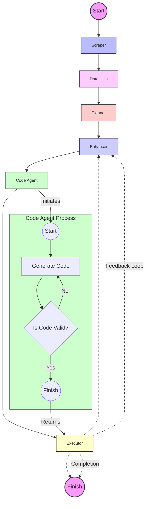

# 🚀 Kaggle Problem Solver: Your AI-Powered ML Sidekick

> Note that because of nature of project it could be very dependant to iterarions and no plan is strait forward for this type of projects.

## TODO

- [x] Add Dockerization for code Executor
- [x] Explainablity
- [x] Logging
- [x] Getting formatted evaluation and code execution result without execution
- [ ] adding code generation to graph
- [x] add re planner to cycle
- [x] revision tasks

## 🌟 Overview

Welcome to the Kaggle Problem Solver, the Swiss Army knife of machine learning challenges! This isn't just any old problem solver – it's your AI-powered companion in the wild world of Kaggle competitions. Using a "plan and execute" strategy that would make any project manager jealous, our system tackles ML problems with the finesse of a seasoned data scientist and the tireless energy of a thousand interns. **code generation agent is inspired from langgraph agent [<u>link</u>](https://blog.langchain.dev/code-execution-with-langgraph/)**

## 🧠 Key Components

1. **The Mastermind (KaggleProblemPlanner)**: Plans your path to Kaggle glory!
2. **The Perfectionist (KaggleTaskEnhancer)**: Turns good tasks into great ones!
3. **The Code Wizard (CodeGenerationAgent)**: Conjures code like magic! ✨
4. **The Strategist (KaggleProblemRePlanner)**: Adapts faster than a chameleon in a rainbow!
5. **The Executor (KaggleCodeExecutor)**: Runs code faster than you can say "machine learning"!

## 🔄 Workflow: The Circle of AI Life

1. Plan → 2. Enhance → 3. Code → 4. Execute → 5. Re-Plan → Repeat!

It's like a never-ending dance party, but with more algorithms and less awkward small talk.

## 🎭 The Agent Graph: A Visual Spectacle

Behold, the pièce de résistance of our project – the Agent Graph! 📊



This isn't just any graph – it's a visual symphony of our agents working in harmony. Watch as data flows through our system like a well-choreographed ballet of bits and bytes!

## 🛠 Setup and Usage

1. Clone this repo faster than you can say "git":

   ```
   git clone https://github.com/msnp1381/kaggle-problem-solver.git
   ```

2. Start the required services using Docker Compose:

   ```
   docker-compose up -d
   ```

3. Install Poetry if you haven't already:

   ```
   curl -sSL https://install.python-poetry.org | python3 -
   ```

4. Set up the Python environment:

   ```
   poetry install
   ```

5. Configure the project:

   - Copy the `.env.template` file to `.env`:
     ```
     cp .env.template .env
     ```
   - Open the `.env` file and fill in the required environment variables.
   - Review and update the `config.ini` file if necessary.

6. Run the main script:

   ```
   poetry run python main.py
   ```

## 🎛 Configuration: Tweak to Your Heart's Content

Customize your config like you're picking toppings for a pizza:

```python
config = {
    "callbacks": [langfuse_handler],
}
```

## 🔧 Extending the System: Build Your Own AI Empire

1. Create new agents like you're assembling an AI Avengers team.
2. Integrate them into `agent.py` – it's like introducing your new friends to your old crew.
3. Update `KaggleProblemSolver` to include your new agent in the coolest workflow in town.

## 📊 Visualization Suggestions: Make It Pop

Why stop at one graph when you can have a whole gallery? Here are some ideas to make your project visually stunning:

1. **The Task Lifecycle Rollercoaster**: Show a task's journey from boring idea to ML masterpiece!
2. **The Metrics Dashboard of Dreams**: Real-time stats that would make any data viz enthusiast weep with joy.
3. **Code Generation: The Movie**: Animate your code generation process. It's like watching a blockbuster, but with more semicolons.
4. **The Interactive Notebook of Wonders**: Let users play with your notebooks. It's like Jupyter, but cooler.
5. **The Dependency Web**: Show how your tasks are connected. It's like LinkedIn, but for algorithms.

## 🤝 Contributing: Join the AI Party

Got ideas? We want them! Check out `CONTRIBUTING.md` for how to join our merry band of AI enthusiasts. Remember, in this repo, there are no bad ideas, only "learning opportunities"!

## 📜 License

This project is licensed under the MIT License - see the `LICENSE` file for details. In other words, go wild, but don't forget to give us a high-five if you use it!

---

Remember, in the world of Kaggle Problem Solving, the only limit is your imagination (and maybe your GPU's memory)! Happy coding, and may the algorithms be ever in your favor! 🎉
