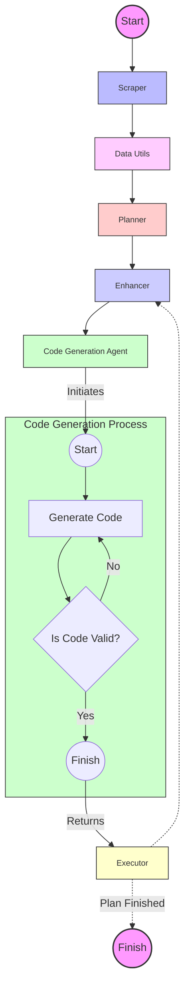

Sure, I'll go ahead and apply the suggested improvements to your Markdown report. Below is the revised version that addresses the issues and incorporates the enhancements discussed:

---

# Kaggle Agent Progress Report

The Kaggle Agent is an autonomous system designed to solve a variety of Kaggle challenges, including tabular machine learning problems, natural language processing (NLP) issues, and computer vision tasks. This project is based on the "plan and execute" agent model but introduces some improvements. Specifically, a module called the **Enhancer** has been developed, which refines the tasks in the plan to achieve the best possible results. Although the **RePlanner** module is not fully implemented yet, the Enhancer is performing satisfactorily, and stable working code has been generated.

## Project Overview

The Kaggle Agent consists of the following modules:

1. **Scraper**
   - Scrapes Kaggle challenges and summarizes the results.
   
2. **Data Utils**
   - Extracts both quantitative and qualitative insights from datasets.
   
3. **Planner**
   - Creates a step-by-step plan based on previous data to achieve the best results.
   
4. **Enhancer**
   - Refines each task in the plan using previous data and execution results to maximize code quality and effectiveness.
   
5. **RePlanner**
   - Adjusts the plan based on feedback and the output of previous executions.
   
6. **Code Generation Agent**
   - Generates the necessary code to execute the plan.
   
7. **Executor**
   - Executes the generated code in a Jupyter server via API and handles interactions with the server.

## System Workflow

Below is a visual representation of the Kaggle Agent's workflow. This diagram illustrates how each module interacts with others and the overall flow from start to finish.

### Module Descriptions

#### Scraper

The **Scraper** module is responsible for collecting data from Kaggle challenges. It extracts three main components:
1. **Challenge Information** - Details about the nature of the challenge.
2. **Challenge Evaluation** - Criteria for judging the solutions.
3. **Challenge Data Description** - Information about the dataset used in the challenge.

These components are processed through separate Large Language Model (LLM) calls to summarize and extract useful information.

#### Data Utils

The **Data Utils** module analyzes the dataset associated with the challenge. It provides both univariate analysis and deeper insights into the data, aligning with the challenge’s data description.

#### Planner

Using data and information collected, the **Planner** module creates a strategic plan to solve the problem and achieve the desired results. This module outlines a step-by-step approach to solving the challenge.

#### Enhancer

The **Enhancer** module improves each step of the plan by incorporating insights from previous data, execution results, and ongoing tasks. Its primary role is to refine tasks to maximize the quality of the generated code and the effectiveness of the problem-solving strategy. This module ensures that every action taken is informed by historical performance, enhancing the likelihood of success.

- **Input:** Receives the initial plan and data from the Planner.
- **Process:** Analyzes ongoing task results and previous data to refine the task.
- **Output:** Enhanced task description ready for code generation.

#### Code Generation Agent

The **Code Generation Agent** creates the actual code required to execute the plan. This implementation is based on the latest research and methodologies relevant to machine learning and AI-driven code generation.

#### Executor

The **Executor** runs the generated code using a Jupyter server. It communicates with the server via API and captures the results through the Jupyter web socket. This execution loop continues until each task of the plan is completed.

### Conclusion

The Kaggle Agent project is making significant progress. The Enhancer module is working effectively, generating stable code, and enhancing task steps. The next step is to implement the RePlanner module to dynamically adjust plans based on execution feedback, which will further increase the agent's adaptability and efficiency. By continuously refining these components, we aim to create a highly autonomous agent capable of solving a wide range of Kaggle challenges.
