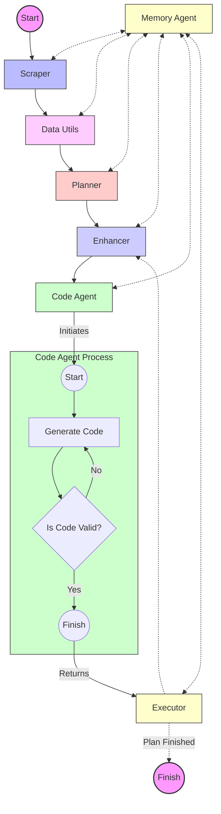

# Kaggle Agent Progress Report

## Executive Summary

The Kaggle Agent project aims to develop an autonomous system capable of solving various Kaggle challenges, including tabular machine learning, natural language processing (NLP), and computer vision tasks. Our agent utilizes a "plan and execute" model with significant enhancements, particularly the introduction of an Enhancer module. Current progress shows stable working code generation, with ongoing developments in planning and execution capabilities.

## 1. Introduction

The Kaggle Agent is an ambitious project designed to automate the process of tackling diverse data science challenges on the Kaggle platform. By leveraging advanced AI techniques and a modular architecture, this goal is to create a system that can autonomously analyze problems, develop solutions, and generate high-quality code to solve these challenges.

## 2. Project Overview

this project is based on the "plan and execute" agent model, with significant improvements tailored for Kaggle challenges. The core of innovation lies in the Enhancer module, which refines tasks within the plan to optimize results. While the Replanner module is still under development, the Enhancer has shown promising performance in generating stable, working code.

## 3. System Architecture

The Kaggle Agent consists of seven key modules, each playing a crucial role in the problem-solving process:

1. **Scraper**: Extracts and summarizes challenge information from Kaggle.
2. **Data Utils**: Analyzes datasets, providing quantitative and qualitative insights.
3. **Planner**: Develops step-by-step solutions based on challenge data and requirements.
4. **Enhancer**: Refines plan tasks using previous data and execution results.
5. **Replanner**: (In development) Will adjust plans based on feedback.
6. **Code Generation Agent**: Produces code for implementing solutions.
7. **Executor**: Runs code via Jupyter server API and processes results.

### System Flow Diagram

## 4. Detailed Module Descriptions

### 4.1 Scraper

The Scraper module is responsible for extracting crucial information from Kaggle challenges. It focuses on three key aspects:

1. Challenge information
2. Evaluation criteria
3. Data description

Each aspect is processed through separate LLM calls to summarize and extract relevant information, providing a comprehensive overview of the challenge.

### 4.2 Data Utils

This module performs in-depth data analysis, including:

- Univariate analysis
- Data visualization
- Statistical summaries

It works in conjunction with the challenge's data description to provide a thorough understanding of the dataset.

### 4.3 Planner

Utilizing information from the Scraper and Data Utils, the Planner creates a detailed, step-by-step plan for solving the challenge. It outlines specific goals and strategies tailored to the challenge requirements.

### 4.4 Enhancer

The Enhancer is a key innovation in our system, designed to refine and optimize tasks within the solution plan. It functions as an AI assistant specializing in task enhancement for Kaggle machine learning problems. Key features include:

- Summarizes previous code and tasks to maintain consistency in the ML notebook
- Interprets results from previous executions to inform current enhancements
- Structures enhanced tasks for optimal understanding by the Code Generation Agent
- Considers the full project context, including problem description, dataset info, and evaluation metrics
- Identifies specific requirements for each task to achieve the best results
- Uses a systematic thought process: Task → Thought → Actions → Observation → Final Answer

The Enhancer's output is a refined, context-aware task description that serves as optimized input for the Code Generation Agent, ensuring each step in the solution process is tailored to the specific Kaggle challenge.

### 4.5 Replanner

Currently under development, the Re-planner will:

- Analyze feedback from executed steps
- Adjust the overall plan as needed
- Ensure adaptability to changing circumstances or unexpected results

### 4.6 Code Generation Agent

Based on recent research in AI-driven code generation, this agent:

- Produces code implementing the enhanced plan
- Ensures code quality and adherence to best practices
- Adapts to specific requirements of each Kaggle challenge

### 4.7 Executor

The Executor module:

- Interfaces with a Jupyter server via API
- Runs generated code in a controlled environment
- Collects and processes results through websocket communication
- Provides feedback for plan refinement and code improvement

### 4.8 Memory Agent

The Memory Agent is a crucial component of our system, responsible for storing, retrieving, and managing both short-term and long-term memory. Key features include:

- **Short-term Memory**: Implemented as a `WeightedMemory` class, it stores recent information with importance weights.
- **Long-term Memory**: Utilizes Chroma, a vector database, for efficient storage and retrieval of documents and examples.
- **Document Management**: Supports adding, retrieving, and searching documents with metadata.
- **Example Storage**: Stores task-code-result examples for future reference and similarity search.
- **Summary Updates**: Maintains an up-to-date summary of the project's progress.
- **Question Answering**: Provides a QA chain for answering questions based on stored information.

## 5. Current Progress and Achievements

- Successfully implemented and integrated the Scraper, Data Utils, Planner, and Enhancer modules
- Achieved stable code generation capabilities
- Developed a functioning execution pipeline via Jupyter server integration
- Implemented a memory module to store and retrieve relevant information across sessions
- Refined the code generation agent to produce more accurate and efficient code
- Expanded the range of Kaggle challenge types the agent can handle
- Implemented a sophisticated Memory Agent with both short-term and long-term memory capabilities
- Integrated Chroma vector database for efficient storage and retrieval of documents and examples
- Developed a system for maintaining and updating project summaries based on task executions
- Created a flexible document management system within the Memory Agent

## 6. Challenges and Future Work

- Complete development and integration of the Replanner module
- Enhance the adaptability of the Code Generation Agent to a wider range of Kaggle challenges
- Improve overall system performance and efficiency
- Conduct comprehensive testing across various challenge types
- Optimize memory usage and retrieval for better context understanding
- Implement more sophisticated error handling and debugging capabilities
- Explore integration with additional external APIs and resources to enhance problem-solving capabilities
- Optimize the integration of the Memory Agent with other modules, particularly the Code Generation Agent
- Improve the efficiency of similarity searches for retrieving relevant examples
- Enhance the summary update mechanism to provide more insightful project overviews
- Develop more advanced filtering and querying capabilities for the long-term memory

## 7. Recent Code Updates

Recent updates to the codebase include:

- Refactoring of the `code_generation_agent.py` to improve modularity and efficiency
- Implementation of a new `memory.py` module for persistent storage of relevant information
- Updates to the main README.md to reflect recent changes and provide clearer setup instructions
- Implementation of the `MemoryAgent` class in `memory.py`, providing comprehensive memory management functionalities
- Integration of the Memory Agent into the `CodeGenerationAgent` class in `code_generation_agent.py`
- Addition of methods in `CodeGenerationAgent` to utilize the Memory Agent for retrieving relevant context and examples
- Implementation of a summary update mechanism to maintain an overview of project progress

## 8. Conclusion

The Kaggle Agent project continues to make significant progress, with the recent addition of the Memory Agent being a major enhancement. This new component allows for more efficient storage and retrieval of information, enabling the system to learn from past experiences and make more informed decisions. The integration of short-term and long-term memory, along with the ability to maintain updated summaries, significantly improves the agent's capability to tackle complex Kaggle challenges.

The use of advanced technologies like Chroma for vector storage and retrieval demonstrates our commitment to employing state-of-the-art solutions. As we move forward, optimizing the interaction between the Memory Agent and other components, particularly the Code Generation Agent, will be crucial for maximizing the system's performance.

Our next steps will focus on refining these integrations, improving the efficiency of similarity searches, and enhancing the overall decision-making process of the agent. These advancements bring us closer to our goal of creating a highly capable autonomous system for solving diverse data science challenges on the Kaggle platform.
