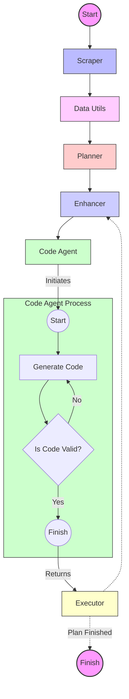

# گزارش پیشرفت عامل کگل

## خلاصه اجرایی

پروژه عامل کگل هدف توسعه یک سیستم خودکار را دارد که قادر به حل چالش‌های مختلف کگل، از جمله یادگیری ماشینی جدولی، پردازش زبان طبیعی (NLP) و وظایف بینایی کامپیوتر است. عامل ما از یک مدل "برنامه‌ریزی و اجرا" با بهبودهای قابل توجه، به ویژه معرفی ماژول تقویت‌کننده استفاده می‌کند. پیشرفت فعلی نشان‌دهنده تولید کد کاری پایدار است، با توسعه‌های جاری در قابلیت‌های برنامه‌ریزی و اجرا.

## ۱. مقدمه

عامل کگل یک پروژه بلندپروازانه است که برای خودکارسازی فرآیند حل چالش‌های متنوع علم داده در پلتفرم کگل طراحی شده است. با بهره‌گیری از تکنیک‌های پیشرفته هوش مصنوعی و معماری ماژولار، هدف این است که سیستمی ایجاد شود که بتواند به طور خودکار مسائل را تحلیل کند، راه‌حل‌ها را توسعه دهد و کد با کیفیت بالا برای حل این چالش‌ها تولید کند.

## ۲. نمای کلی پروژه

این پروژه بر اساس مدل عامل "برنامه‌ریزی و اجرا" است، با بهبودهای قابل توجهی که برای چالش‌های کگل تنظیم شده است. هسته نوآوری در ماژول تقویت‌کننده نهفته است که وظایف را در برنامه برای بهینه‌سازی نتایج پالایش می‌کند. در حالی که ماژول برنامه‌ریزی مجدد هنوز در حال توسعه است، تقویت‌کننده عملکرد امیدوارکننده‌ای در تولید کد کاری پایدار نشان داده است.

## ۳. معماری سیستم

عامل کگل از هفت ماژول کلیدی تشکیل شده است که هر کدام نقش مهمی در فرآیند حل مسئله ایفا می‌کنند:

۱. **خراشنده**: اطلاعات چالش را از کگل استخراج و خلاصه می‌کند.
۲. **ابزارهای داده**: مجموعه داده‌ها را تحلیل می‌کند و بینش‌های کمی و کیفی ارائه می‌دهد.
۳. **برنامه‌ریز**: راه‌حل‌های گام به گام را بر اساس داده‌های چالش و الزامات توسعه می‌دهد.
۴. **تقویت‌کننده**: وظایف برنامه را با استفاده از داده‌های قبلی و نتایج اجرا پالایش می‌کند.
۵. **برنامه‌ریز مجدد**: (در حال توسعه) برنامه‌ها را بر اساس بازخورد تنظیم خواهد کرد.
۶. **عامل تولید کد**: کد را برای پیاده‌سازی راه‌حل‌ها تولید می‌کند.
۷. **اجراکننده**: کد را از طریق API سرور ژوپیتر اجرا می‌کند و نتایج را پردازش می‌کند.

### نمودار جریان سیستم

## ۴. توضیحات تفصیلی ماژول‌ها

### ۴.۱ خراشنده

ماژول خراشنده مسئول استخراج اطلاعات حیاتی از چالش‌های کگل است. این ماژول بر سه جنبه کلیدی تمرکز دارد:

۱. اطلاعات چالش
۲. معیارهای ارزیابی
۳. توصیف داده‌ها

هر جنبه از طریق فراخوانی‌های جداگانه LLM برای خلاصه‌سازی و استخراج اطلاعات مربوطه پردازش می‌شود و یک نمای کلی جامع از چالش ارائه می‌دهد.

### ۴.۲ ابزارهای داده

این ماژول تحلیل عمیق داده‌ها را انجام می‌دهد، از جمله:

- تحلیل تک متغیره
- تجسم داده‌ها
- خلاصه‌های آماری

این ماژول در ترکیب با توصیف داده‌های چالش برای ارائه درک کاملی از مجموعه داده کار می‌کند.

### ۴.۳ برنامه‌ریز

با استفاده از اطلاعات خراشنده و ابزارهای داده، برنامه‌ریز یک طرح تفصیلی، گام به گام برای حل چالش ایجاد می‌کند. این طرح اهداف و استراتژی‌های خاصی را که متناسب با الزامات چالش است، مشخص می‌کند.

### ۴.۴ تقویت‌کننده

تقویت‌کننده یک نوآوری کلیدی در سیستم ما است که برای پالایش و بهینه‌سازی وظایف در طرح راه‌حل طراحی شده است. این ماژول به عنوان یک دستیار هوش مصنوعی تخصصی در بهبود وظایف برای مسائل یادگیری ماشینی کگل عمل می‌کند. ویژگی‌های کلیدی شامل:

- خلاصه‌سازی کد و وظایف قبلی برای حفظ سازگاری در دفترچه یادداشت ML
- تفسیر نتایج از اجراهای قبلی برای اطلاع‌رسانی به بهبودهای فعلی
- ساختاردهی وظایف بهبود یافته برای درک بهینه توسط عامل تولید کد
- در نظر گرفتن زمینه کامل پروژه، از جمله توصیف مسئله، اطلاعات مجموعه داده و معیارهای ارزیابی
- شناسایی الزامات خاص برای هر وظیفه برای دستیابی به بهترین نتایج
- استفاده از یک فرآیند فکری سیستماتیک: وظیفه → تفکر → اقدامات → مشاهده → پاسخ نهایی

خروجی تقویت‌کننده یک توصیف وظیفه پالایش شده و آگاه از زمینه است که به عنوان ورودی بهینه‌سازی شده برای عامل تولید کد عمل می‌کند و اطمینان حاصل می‌کند که هر مرحله در فرآیند راه‌حل برای چالش خاص کگل تنظیم شده است.

### ۴.۵ برنامه‌ریز مجدد

در حال حاضر در حال توسعه، برنامه‌ریز مجدد:

- بازخورد از مراحل اجرا شده را تحلیل می‌کند
- طرح کلی را در صورت نیاز تنظیم می‌کند
- اطمینان از سازگاری با شرایط متغیر یا نتایج غیرمنتظره

### ۴.۶ عامل تولید کد

بر اساس تحقیقات اخیر در تولید کد مبتنی بر هوش مصنوعی، این عامل:

- کد پیاده‌سازی طرح بهبود یافته را تولید می‌کند
- کیفیت کد و پایبندی به بهترین شیوه‌ها را تضمین می‌کند
- با الزامات خاص هر چالش کگل سازگار می‌شود

### ۴.۷ اجراکننده

ماژول اجراکننده:

- از طریق API با یک سرور ژوپیتر ارتباط برقرار می‌کند
- کد تولید شده را در یک محیط کنترل شده اجرا می‌کند
- نتایج را از طریق ارتباط وبسوکت جمع‌آوری و پردازش می‌کند
- بازخورد برای پالایش طرح و بهبود کد ارائه می‌دهد

## ۵. پیشرفت فعلی و دستاوردها

- پیاده‌سازی و ادغام موفق ماژول‌های خراشنده، ابزارهای داده، برنامه‌ریز و تقویت‌کننده
- دستیابی به قابلیت‌های تولید کد پایدار
- توسعه یک خط لوله اجرایی کارآمد از طریق ادغام سرور ژوپیتر

## ۶. چالش‌ها و کار آینده

- تکمیل توسعه و ادغام ماژول برنامه‌ریز مجدد
- افزایش سازگاری عامل تولید کد با طیف گسترده‌تری از چالش‌های کگل
- بهبود عملکرد و کارایی کلی سیستم
- انجام آزمایش‌های جامع در انواع مختلف چالش‌ها

## ۷. نتیجه‌گیری

پروژه عامل کگل پیشرفت‌های قابل توجهی در خودکارسازی فرآیند حل چالش‌های علم داده داشته است. با عملیاتی شدن ماژول‌های کلیدی و تولید نتایج پایدار، ما در موقعیت خوبی برای ادامه توسعه و پالایش قرار داریم. مراحل بعدی بر تکمیل ماژول برنامه‌ریز مجدد و بهبود عملکرد کلی سیستم برای مقابله مؤثر با طیف گسترده‌تری از چالش‌های کگل تمرکز دارد.
